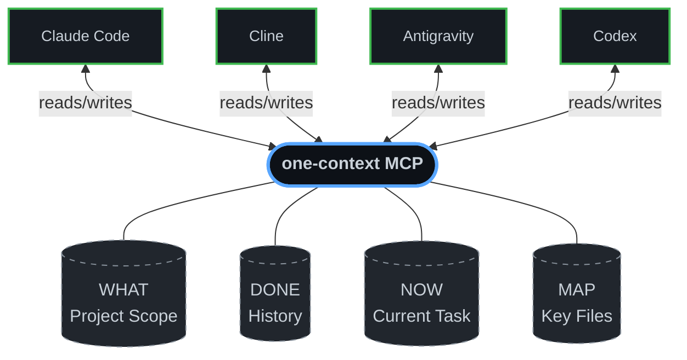

# one-context

> Stop re-explaining your project to every AI tool you open.

---

## The Problem

You use multiple AI coding tools — Claude, Cline, Codex, Antigravity. Each one is powerful. But every time you switch, it's back to square one:

> *"This is a FastAPI backend, the database is PostgreSQL, we're using async SQLAlchemy, the main entry point is `src/main.py`, we were just working on the auth middleware..."*

You say this dozens of times a day. It costs focus, time, and tokens.

**one-context fixes this permanently.**

---

## The Solution

`one-context` is a local MCP server that acts as shared memory for all your AI tools. Every tool reads from it when it wakes up and writes to it when it finishes. Your project knowledge lives in one place, forever.



You explain your project **once**. Every tool knows it **forever**.

**100% local. No cloud. No API keys. No sign-ups.**

---

## Install

### For Claude Desktop, Cline, Codex, and any MCP client

Add this to your MCP config file. That's it — `uvx` handles the rest automatically:

```json
{
  "mcpServers": {
    "one-context": {
      "command": "uvx",
      "args": ["one-ctx", "stdio"]
    }
  }
}
```

> **Where is the config file?**
> - **Claude Desktop (Mac):** `~/Library/Application Support/Claude/claude_desktop_config.json`
> - **Claude Desktop (Windows):** `%APPDATA%\Claude\claude_desktop_config.json`
> - **Cline / VS Code:** Settings → Cline → MCP Servers
> - **Codex:** `~/.codex/config.toml`

No server to start. No background process to manage. The AI tool launches `one-context` automatically when it needs it.

### Or install manually

```bash
pip install one-ctx
```

---

## How to Use It

Once installed, you just talk to your AI tool naturally:

**At the start of a session:**
```
"Load my project context from one-context for the 'my-api' project."
```

**At the end of a session:**
```
"Save our progress to one-context. We finished the JWT middleware and
registered src/auth.py as the auth entry point."
```

**That's it.** The next time you open any AI tool — whether it's Claude, Cline, or Codex — you just ask it to load context, and it instantly knows everything: what the project is, what you've done, what you're working on, and which files matter.

---

## What Gets Stored

`one-context` organizes your project knowledge into four clear buckets:

| Bucket | What it stores | Example |
|--------|----------------|---------|
| **WHAT** | Project description, tech stack, architecture | *"FastAPI backend, PostgreSQL, async SQLAlchemy, deployed on Railway"* |
| **DONE** | Completed work, decisions made, problems solved | *"Finished JWT auth. Decided to use UUIDs for user IDs instead of integers."* |
| **NOW** | Current task and next steps | *"Working on rate limiting middleware. Next: write integration tests."* |
| **MAP** | Important files and what each one does | *"`src/auth.py` — JWT middleware. `db/schema.sql` — Database schema."* |

### The MAP bucket (the secret weapon)

The MAP bucket is what makes `one-context` feel like magic. When any AI tool mentions a file path, `one-context` automatically extracts and saves it. The next AI tool that opens your project instantly knows which files are important — without having to scan your entire codebase.

You can also register files manually:
```
"Use ctx_map to register src/main.py as the application entry point."
```

---

## Git Awareness

Link your project to a git repo once:

```bash
ctx init my-api --path /path/to/my-api
```

Now every time any AI tool loads your context, it also gets:

- ✅ Current branch name
- ✅ Last 5 commit messages
- ✅ List of staged, unstaged, and untracked files

The AI instantly knows what branch it's on and what has changed — no need to run `git status` manually.

---

## Cross-Project Search

Working across multiple projects? Search your memory across all of them:

```bash
ctx search "SQLite locking"
```

This searches through every project's context and update history. If you solved a tricky bug three months ago on a different project, you'll find it instantly.

---

## MCP Tools Reference

These are the tools exposed to AI assistants:

| Tool | What it does |
|------|-------------|
| `ctx_get(project)` | Load full context — WHAT, DONE, NOW, MAP, and live git info |
| `ctx_update(project, summary)` | Merge a session update into memory |
| `ctx_map(project, files)` | Manually register important file paths |
| `ctx_search(query)` | Search across all projects and history |
| `ctx_reset(project)` | Clear a project's context |
| `ctx_list()` | List all tracked projects |

Projects are **created automatically** on the first `ctx_update`. You don't need to initialize anything.

---

## CLI Reference

```bash
ctx status [project]          # View current context for a project
ctx search <query>            # Search across all projects
ctx init <project> [--path]   # Initialize with optional git repo link
ctx reset <project>           # Clear a project's context
ctx list                      # List all tracked projects
ctx delete <project>          # Permanently delete a project
ctx serve [--port 7337]       # Start as HTTP/SSE server for network setups
ctx stdio                     # Start as stdio server (used by MCP clients)
```

---

## Smart Merging (No AI Required)

When an AI tool calls `ctx_update`, the server merges the new information into the right buckets automatically. By default, this uses a fast, local rule-based merge — **no LLM required, no API key, no cost.**

If you want smarter summaries, you can optionally enable an LLM:

| Mode | How to enable | API key? |
|------|--------------|----------|
| **Local** *(default)* | Nothing — just works | ❌ No |
| **Ollama** | Set `CTX_OLLAMA_MODEL=llama3.2` | ❌ No |
| **Anthropic Claude** | Set `ANTHROPIC_API_KEY=...` | ✅ Yes |
| **OpenAI / Groq / Together** | Set `OPENAI_API_KEY=...` | ✅ Yes |

The system tries providers in order and silently falls back. **Local always works.**

---

## HTTP Mode (Advanced)

For teams or remote setups, you can run `one-context` as a persistent HTTP server:

```bash
ctx serve --port 7337
```

Then point any MCP client to `http://localhost:7337/sse`.

---

## License

MIT — do whatever you want with it.

---

*Built to end context amnesia across AI tools.*
