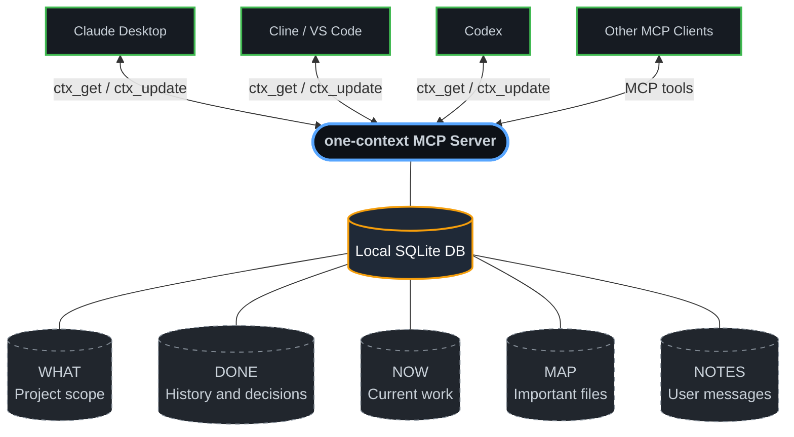
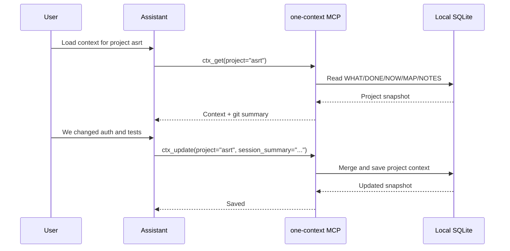

# one-context-mcp

> One local MCP server that gives Claude, Cline, Codex, and other AI tools the same project memory.

`one-context-mcp` stops the repeated setup explanation every time you switch AI tools. It stores project context locally in a small SQLite database and exposes it through MCP tools that every connected assistant can read and update.

- PyPI package: `one-ctx`
- Main CLI command: `one-context`
- Alternate CLI commands: `ctx`, `one-ctx`
- GitHub repo: `m4vic/one-context-mcp`
- Default merge mode: local rules only, no model and no API key

---

## Why It Exists

Every coding assistant has its own short-term context. When you move from Claude to Cline, from Cline to Codex, or from one IDE session to another, you usually explain the same project again:

> This is a FastAPI backend, PostgreSQL is the database, `src/main.py` is the entry point, we just changed auth, and next we need rate limiting.

`one-context-mcp` makes that explanation persistent and shared.

---

## Architecture



Everything is local by default. No account, no cloud service, no vector database, and no LLM API call is required.

---

## Install

### Option 1: Use `uvx` in any MCP client

This is the recommended setup. `uvx` downloads and runs the PyPI package automatically.

```json
{
  "mcpServers": {
    "one-context": {
      "command": "uvx",
      "args": ["--from", "one-ctx", "one-context", "stdio"]
    }
  }
}
```

Restart the MCP client after editing the config.

### Option 2: Install with pip

```bash
pip install -U one-ctx
one-context stdio
```

These commands are equivalent:

```bash
one-context stdio
one-ctx stdio
ctx stdio
```

### Option 3: Run from source

```bash
git clone https://github.com/m4vic/one-context-mcp.git
cd one-context-mcp
pip install -e .
one-context stdio
```

For local development MCP config:

```json
{
  "mcpServers": {
    "one-context": {
      "command": "python",
      "args": ["-m", "ctx.cli", "stdio"],
      "cwd": "F:\\combinedcontext"
    }
  }
}
```

Replace `F:\\combinedcontext` with your local repo path.

---

## MCP Client Setup

### Claude Desktop

Config file locations:

- Windows: `%APPDATA%\Claude\claude_desktop_config.json`
- macOS: `~/Library/Application Support/Claude/claude_desktop_config.json`

Add:

```json
{
  "mcpServers": {
    "one-context": {
      "command": "uvx",
      "args": ["--from", "one-ctx", "one-context", "stdio"]
    }
  }
}
```

Fully quit Claude Desktop and reopen it.

### Cline / VS Code

Open Cline MCP settings and add:

```json
{
  "mcpServers": {
    "one-context": {
      "command": "uvx",
      "args": ["--from", "one-ctx", "one-context", "stdio"],
      "disabled": false,
      "autoApprove": []
    }
  }
}
```

Reload VS Code after changing the file.

### Codex

Add this to `~/.codex/config.toml`:

```toml
[mcp_servers.one-context]
command = "uvx"
args = ["--from", "one-ctx", "one-context", "stdio"]
```

Start a fresh Codex session after changing MCP config.

---

## First Use

Use a stable project name. For example, use `asrt` every time you refer to the ASRT project.

Ask your assistant:

```text
Use one-context. Link project asrt to F:\ASRT, then load context.
```

At the end of a work session:

```text
Update one-context for project asrt with what we changed, what is done, what is next, and important files.
```

To add a direct user note:

```text
Add a one-context note for project asrt: Keep SafetyDiff as priority after MVP.
```

---

## What Gets Stored

| Bucket | Purpose | Example |
|--------|---------|---------|
| `WHAT` | Project identity, stack, architecture, constraints | FastAPI backend with PostgreSQL and async SQLAlchemy |
| `DONE` | Completed work, decisions, solved issues | JWT auth implemented, UUID user IDs chosen |
| `NOW` | Current task and next steps | Working on rate limiting middleware |
| `MAP` | Important files and what they do | `src/auth.py` - auth middleware |
| `NOTES` | User-authored project messages | Remember to keep ASRT context strict |

MAP entries are normalized and deduplicated. When a project is linked to a `repo_path`, file tracking is scoped to that repo so context from different projects does not get mixed.

---

## Tool Flow



---

## MCP Tools

| Tool | Purpose |
|------|---------|
| `ctx_get(project)` | Load WHAT, DONE, NOW, MAP, repo path, and git info |
| `ctx_strict_get(project, repo_path)` | Load context only when the current workspace path matches the linked project |
| `ctx_update(project, session_summary, tool_name)` | Merge a session summary into project context |
| `ctx_map(project, files, replace)` | Register important files manually |
| `ctx_note(project, message, author, merge)` | Store a user-authored note for one project |
| `ctx_history(project, limit)` | Show recent updates and user notes for one project |
| `ctx_link(project, repo_path)` | Create/link a project to a workspace root for strict file scoping |
| `ctx_search(query)` | Search all projects, update history, and user notes |
| `ctx_reset(project)` | Clear one project's context |
| `ctx_list()` | List tracked projects |

---

## CLI Reference

```bash
ctx status [project]          # View current context or list projects
ctx init <project> --path .   # Create/link project to repo path
ctx search <query>            # Search across projects and history
ctx reset <project>           # Clear a project's context
ctx delete <project>          # Permanently delete a project
ctx list                      # List all projects
ctx serve --port 7337         # Start HTTP/SSE server
ctx stdio                     # Start stdio MCP server
```

HTTP/SSE mode:

```bash
ctx serve --host 127.0.0.1 --port 7337
```

Then connect MCP clients to:

```text
http://127.0.0.1:7337/sse
```

---

## Merge Modes

Local merge is the default and never calls a model.

| Mode | Enable | Uses model/API? |
|------|--------|-----------------|
| Local | Default or `CTX_MERGE_MODE=local` | No |
| Auto | `CTX_MERGE_MODE=auto` | Tries configured providers |
| Ollama | `CTX_MERGE_MODE=ollama` and `CTX_OLLAMA_MODEL=llama3.2` | Local model |
| Anthropic | `CTX_MERGE_MODE=anthropic` and `ANTHROPIC_API_KEY=...` | Yes |
| OpenAI compatible | `CTX_MERGE_MODE=openai` and `OPENAI_API_KEY=...` | Yes |

Recommended default:

```bash
CTX_MERGE_MODE=local
```

You do not need any API key for normal use.

---

## Verify Installation

```bash
uvx --from one-ctx one-context --help
uvx --from one-ctx one-context stdio
```

For a local source checkout:

```bash
python -m compileall ctx
python -m build
python -m twine check dist/*
```

---

## Release Downloads

Install the latest PyPI release:

```bash
pip install -U one-ctx
```

Install a specific version:

```bash
pip install one-ctx==0.2.1
```

Install directly from GitHub:

```bash
pip install git+https://github.com/m4vic/one-context-mcp.git
```

Download source from GitHub Releases:

```text
https://github.com/m4vic/one-context-mcp/releases
```

---

## Troubleshooting

### MCP client does not show tools

1. Confirm the config has a top-level `mcpServers` object.
2. Use the exact `uvx` command shown above.
3. Fully restart Claude, Cline, Codex, or the MCP client.
4. Test the command manually:

```bash
uvx --from one-ctx one-context --help
```

### Local source works but PyPI does not

Use:

```bash
pip install -U one-ctx
```

Then restart the MCP client. MCP clients often cache tool surfaces until a fresh session.

### Project context is mixed

Use `ctx_link(project, repo_path)` once per project and keep the same project name in every tool.

Example:

```text
Use ctx_link for project asrt with repo_path F:\ASRT.
```

For stricter reads, ask the assistant to call `ctx_strict_get(project, repo_path)`.
It refuses to return context if the folder does not match the linked project.

---

## License

MIT

---

Built to end context amnesia across AI tools.
